# Device Farm 使用方法

## 登录AWS管理控制台
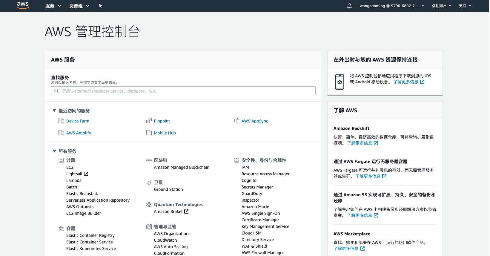

## 选择或搜索Device Farm
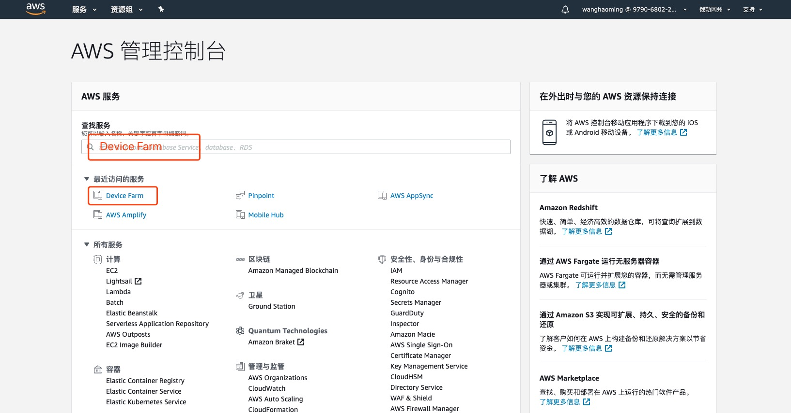

## 创建一个新的工程
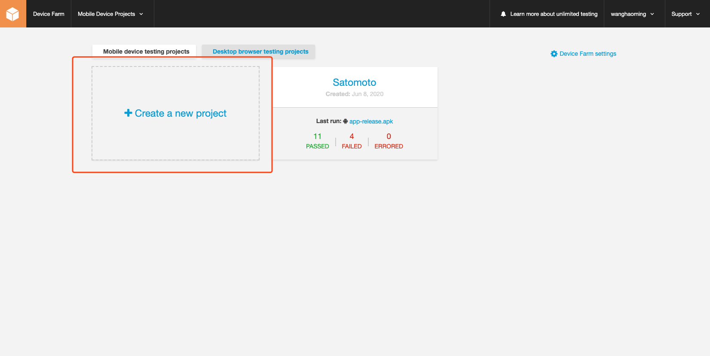

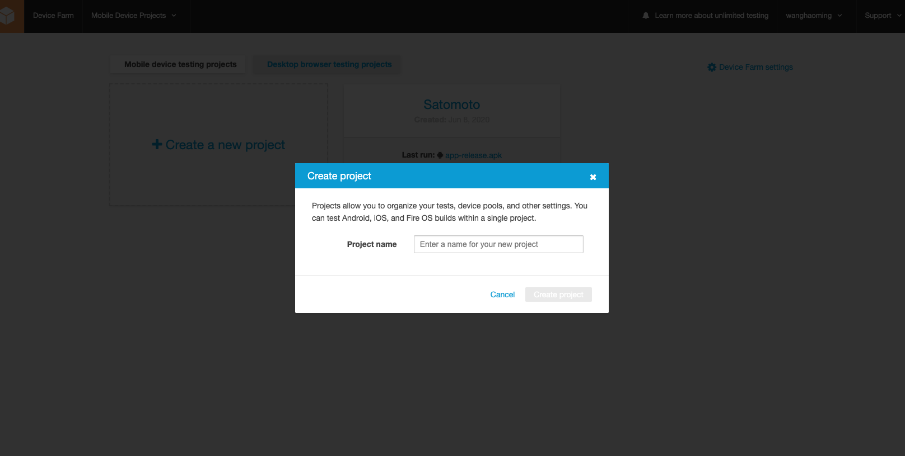

## 点击创建好的工程进入详细页
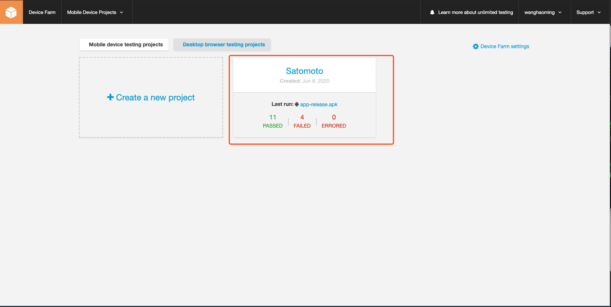

## 详情页点击创建新的运行
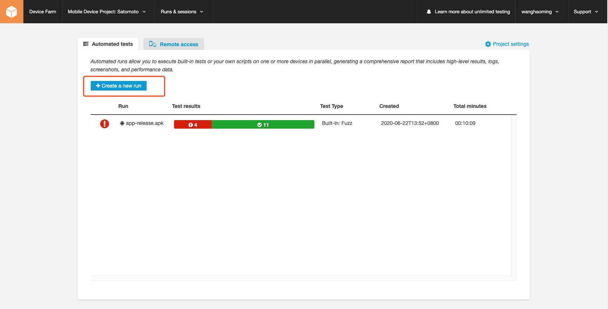

## 开始配置测试项
### 选择要测试的application
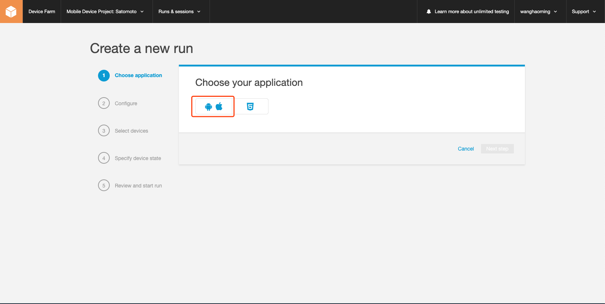
### 上传编译好的程序-》点击Next Step

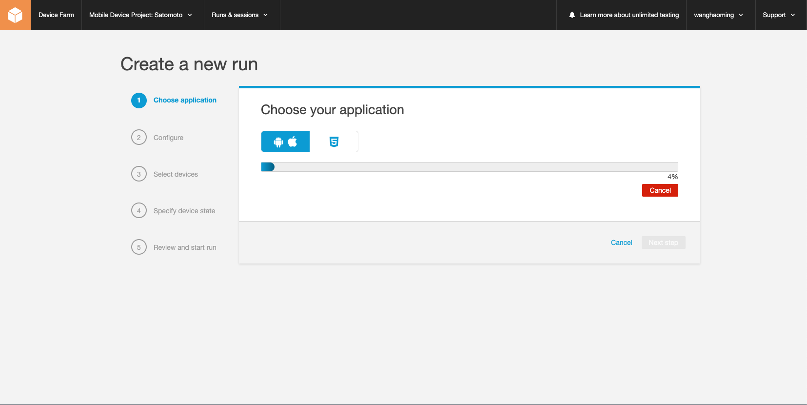
### 显示打包信息-》点击Next Step
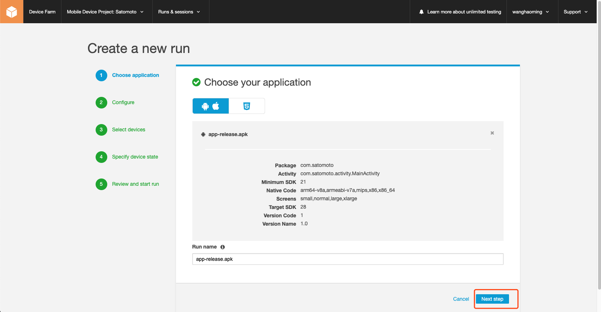
### 配置其他内容
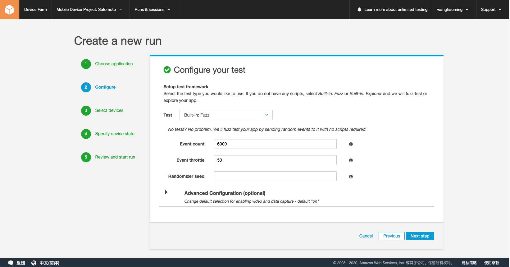

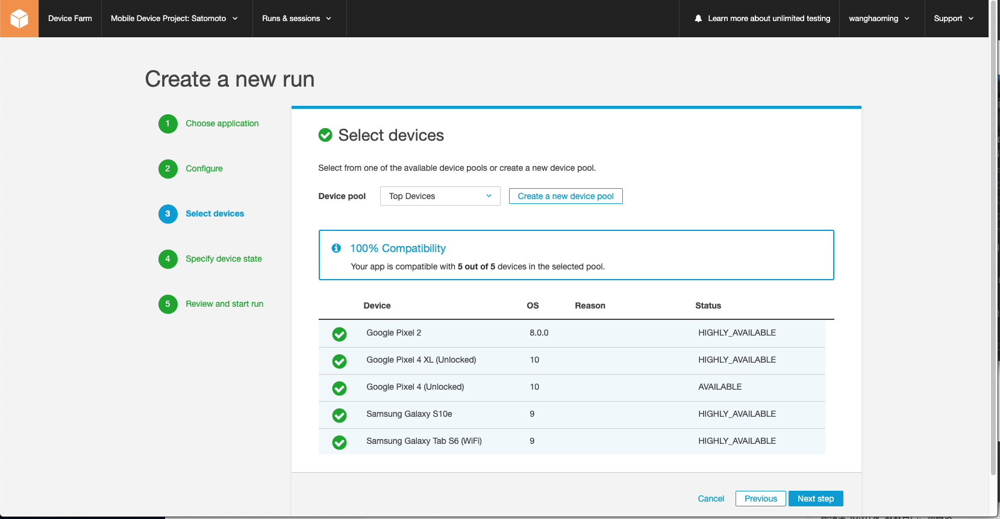

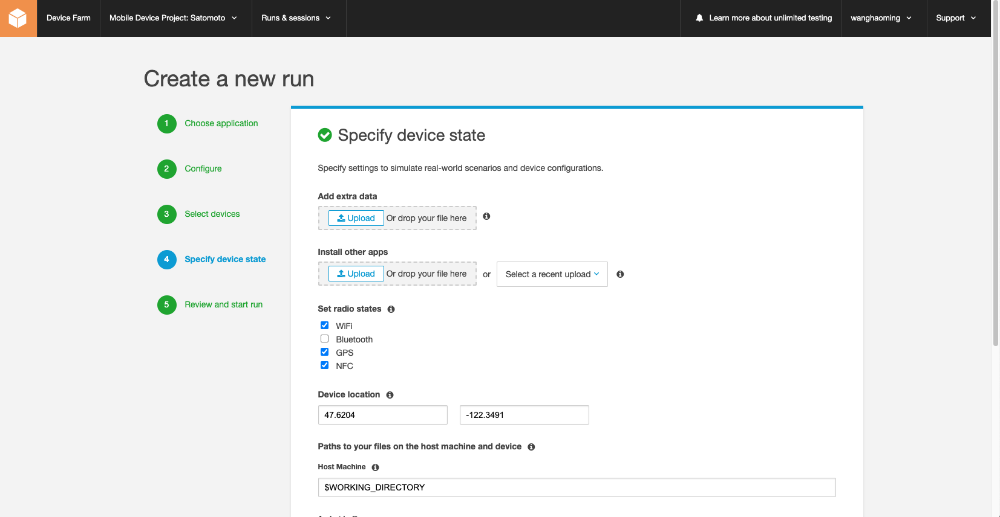
### 点击Confirm and start run
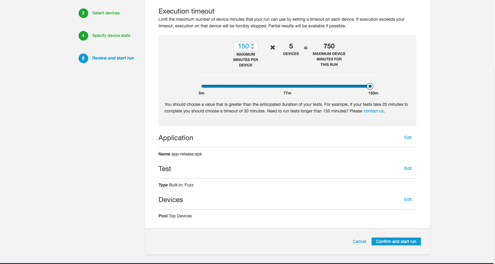

## 查看测试结果
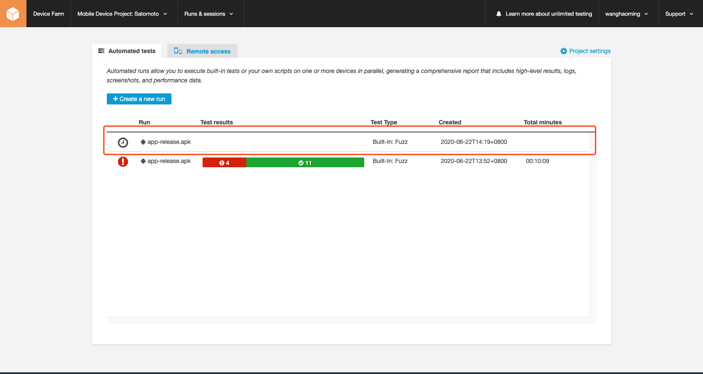

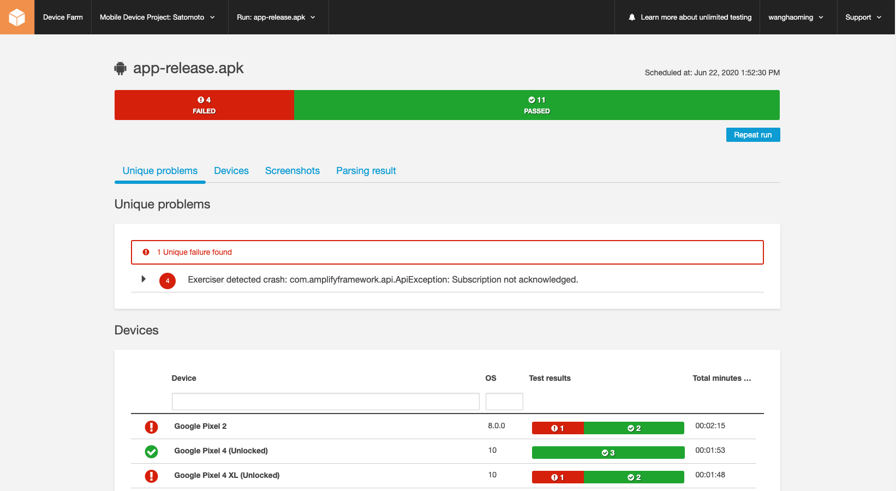